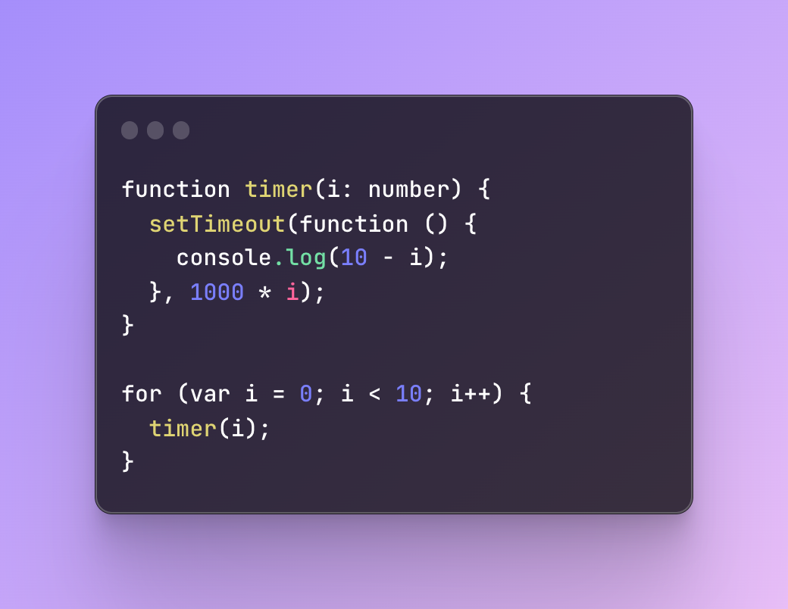

# dg-frontend-task-solution
My solution to the frontend task for de gruyter.

**Task 1:**  
You can find the **ISBN validator** function in <code>/src/helper/isbnIsValid.ts</code> 
You can find the **roman numeral converter** function in <code>/src/helper/numberToRomanNumeral.ts</code> 
You can **start the website** by cloning this repository to you local machine and follow these instructions:
  - Go to <code>dg-frontend-task-solution</code> folder on your machine
  - Run <code>npm install</code>
  - Run <code>npm run dev</code>
  - Open the dev server

**Task 2:**
The output of the function below is: 
0 1 2 3 4 5 6 7 8 9 
 This output is generated immediately, because the generated callbacks from setTimeout all fire after 1000 ms.

The desired behavior of a timer however, is that each second, another output is generated, starting from the highest to the lowest. 
To achieve the desired output change the code:

